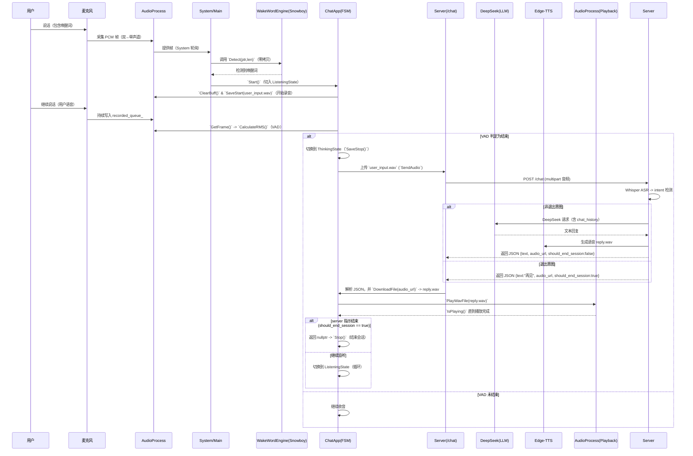

**项目概览**
- **目标**：构建运行在 Rockchip RV1106 的嵌入式 AI 语音助手（Echo‑Mate），支持离线唤醒、录音上行、云端 ASR/LLM/TTS 回应并播放。
- **核心架构模式**：采用“系统层 (Launcher) + 应用层 (App)”分层设计：
  - 系统层由 `main` 启动并运行 UI 与系统守护逻辑，负责唤醒检测与 App 生命周期管理（见 main.cc）。
  - 应用层由 `ChatApp` 驱动，内部以有限状态机（FSM）组织对话流（`Listening` → `Thinking` → `Speaking` → `Listening` / 退出）。
- **业务流转控制**：FSM（状态对象实现）负责输入采集、VAD 判定、上传处理与播放控制，System 层仅在“非应用运行”时喂音频到唤醒引擎。

**系统核心模块解析**
- **系统入口 (main.cc)**
  - 作用：系统启动器与主循环。初始化 LVGL UI、应用管理、唤醒引擎 (`WakeWordEngine`) 与 `ChatApp`，并在主循环中根据 `ChatApp::IsRunning()` 决定流转：
    - 当 `ChatApp` 未运行时，从 `AudioProcess` 获取帧并调用 `WakeWordEngine::Detect`；若返回 >0，调用 `ChatApp::Start()` 并 `AudioProcess::ClearBuff()`（避免把唤醒词音频录入会话）。
    - 当 `ChatApp` 运行时，调用 `ChatApp::RunOnce()` 由 FSM 驱动会话流程。
  - 关键设计点：将唤醒检测放在 System 层保证“App 是可替换的”，主循环节拍 5ms，低开销轮询（见 main.cc）。
- **唤醒引擎 (WakeWordEngine.cc)**
  - 作用：封装 Snowboy 检测器（`snowboy::SnowboyDetect`），提供初始化与检测接口。
  - 关键逻辑：
    - `Init(...)` 创建并配置 `SnowboyDetect`（sensitivity, gain 等）。
    - 提供两类 `Detect` 重载：`Detect(const std::vector<int16_t>&)` 与 `Detect(const int16_t* data, int len)`。后者为核心实现，前者仅转发到指针版本。
  - 设计价值：重载 + 指针版本实现“零拷贝兼容”（支持 ring buffer、mmap、C 数组），同时向上层保持易用的 `vector` 接口（见 WakeWordEngine.cc）。
- **音频服务 (AudioProcess.cc)**
  - 总体职责：异步录音与播放后台服务，适配 TinyALSA，面向上层提供帧获取/播放/保存接口。
  - 生产者-消费者模型：
    - `RecordLoop()`（录音线程）：从硬件阻塞读取双声道数据，做“双声道→单声道”转换（取左通道），把单声道帧 push 到 `recorded_queue_`（受 `record_mutex_` 保护）。同时支持文件写入（`SaveStart`/`SaveStop`）和错误恢复（XRUN 处理、重 open）。
    - `PlayLoop()`（播放线程）：在 `playback_cv_` 条件下等待 `playback_queue_` 的数据，取出后做单声道→双声道扩展然后 `pcm_write` 到硬件。
  - 线程安全与并发控制：
    - 使用 `std::mutex` 保护 `recorded_queue_`（`record_mutex_`）、`playback_queue_`（`playback_mutex_`）和文件操作（`file_mutex_`）。
    - 使用 `std::condition_variable playback_cv_` 用于唤醒播放线程以避免忙等。
    - 使用原子变量 `is_running_`（`std::atomic<bool>`）用于线程安全停止/检测循环。
  - 零拷贝与效率：
    - `GetFrame(std::vector<int16_t>& chunk)` 通过 `chunk = std::move(recorded_queue_.front())` 实现移动语义，避免拷贝。
    - `ClearBuff()` 使用 `swap` 以 O(1) 清空队列。
  - `IsPlaying()` 实现：
    - 通过在 `playback_mutex_` 锁下检查 `playback_queue_.empty()`，若非空则认为仍在播放（简单且线程安全）。
  - RMS 与 WAV 头处理：
    - `CalculateRMS(const std::vector<int16_t>&)` 计算均方根：sum(sample^2) / N 的平方根，用于 VAD 能量判定。
    - `SaveStart(filename)`：打开文件、先写入 44 字节占位 WAV 头（`WavHeader` 空数据），随后追加 PCM 数据。
    - `SaveStop()`：seek 到文件尾得到 data_size，回到文件头重写 `WavHeader`（设置 `data_size` 与 `overall_size`），再关闭文件——经典“先占位、后回填”策略保证流式写入且避免一次性内存缓存。
  - 硬件适配与流控：对 RV1106 的双声道硬件做适配（读取双声道、只取左声道），播放端在 `PlayWavFile` 中做队列积压检测并短暂 sleep 做背压控制。
  - 参考文件： AudioProcess.cc。
- **网络服务 (NetworkClient.cc)**
  - 作用：负责把录音上行到后端服务、下载返回的音频文件、以及简单的 GET 请求。
  - `SendAudio(filepath, out_should_exit)` 关键点：
    - 使用 libcurl 的 multipart (`curl_mime`) 上传 `audio` 表单字段到 `/chat`。
    - 使用 `WriteStringCallback` 将服务器响应逐块拼接到 `std::string response`。
    - 使用简单字符串搜索函数 `ParseBoolFromJson(response, "should_end_session")` 来判断服务器返回 JSON 中的 `should_end_session` 是否为 `true`，若是则通过输出参数 `out_should_exit` 标志上层结束会话。
    - 为避免 Expect 100/Transfer-Encoding 引起的问题，添加并释放空的 header（`"Expect:"`, `"Transfer-Encoding:"`）。
  - 下载逻辑（`DownloadFile`）使用 `WriteFileCallback` 将服务器音频流写到本地文件并有超时保护。
  - 参考文件： NetworkClient.cc。

**AI 对话应用 (AI_chat)**
- **应用控制器 (`ChatApp`)**
  - `Init()`：确保 `AudioProcess` 单例启动（后台线程启动）。
  - `Start()`：防止重复启动；重置上下文标志（`ctx_.should_exit = false`），`ChangeState(new ListeningState())` 切入 `Listening`，并把 `is_running_` 置为 true。
  - `RunOnce()`：每次主循环调用；主要流程：
    - 检查 `ctx_.should_exit`（若 true，则 `Stop()` 并返回）。
    - 调用 `current_state_->Update(&ctx_)` 获取 `next_state`（可能为同一对象、不同对象或 `nullptr`）。
    - 若 `next_state != current_state_`，通过 `ChangeState(next_state)` 清理并进入新状态；若 `current_state_` 变为 `nullptr`，说明会话结束，`Stop()`。
  - `Stop()`：退出并删除当前状态对象，置 `is_running_ = false`。
  - 关键点：状态转换由 `StateBase` 的 `Update` 返回新状态指针（或 `nullptr`），`ChatApp` 负责生命周期（Delete）管理，保证状态对象析构在单一位置（易于资源释放）。
  - 参考文件： chat_app.cc。
- **状态机流转**
  - **ListeningState**（listening_state.cc）
    - `Enter()`：播放唤醒反馈音（`WAKE_REPLY_SOUND`）并轮询 `AudioProcess::IsPlaying()` 等待音效播放完毕，随后 `ClearBuff()` 并 `SaveStart(RECORD_FILE)` 开始写文件。
    - `Update()`（VAD 实现）：
      - 每帧通过 `AudioProcess::GetFrame(frame_data)` 获取 PCM 帧并调用 `AudioProcess::CalculateRMS(frame_data)` 得到 `rms`。
      - 若 `rms > VAD_THRESHOLD`（代码中默认 2000）则认为“有声音”，设置 `has_speech_started_ = true` 并把 `silence_counter_ = 0`。
      - 若 `rms <= VAD_THRESHOLD` 并且 `has_speech_started_` 为真，则 `silence_counter_++`。
      - 退出到 `ThinkingState` 的条件：
        - 已经开始说话且 `silence_counter_ > MAX_SILENCE_FRAMES`（默认 30 帧 ≈ 2 秒静音），或
        - 录音超过 `MAX_RECORD_FRAMES`（默认 150 帧 ≈ 10 秒），或
        - 一直未检测到说话且超时（`total_frames_ > 80` ≈ 5 秒）——这些都返回 `new ThinkingState()`。
      - `Exit()` 调用 `AudioProcess::SaveStop()` 完成 WAV 头回填。
    - 设计要点：基于能量阈值（RMS）+ 静音计数器 `silence_counter_` + 最大时长，组成稳健的 VAD，简单且易于调参。
  - **ThinkingState**（thinking_state.cc）
    - `Enter()`：UI/日志提示“上传中”。
    - `Update()`：
      - 设置后端 IP（示例中硬编码 `192.168.137.1`，可改为配置）。
      - 调用 `ctx->network->SendAudio("user_input.wav", server_wants_exit)`；`SendAudio` 会把 `should_end_session` 解析到 `server_wants_exit`，随后 `ctx->should_exit = server_wants_exit`。
      - 若服务器返回 JSON 串中包含 `audio_url`，调用 `ctx->network->DownloadFile("/get_audio/reply.wav", "reply.wav")` 并根据下载成功返回 `new SpeakingState(true/false)`。
      - 若返回空或失败则 `SpeakingState(false)`（可由该状态播放错误提示）。
    - 关键点：将“是否结束会话”的决策从服务端带回并设入 `ctx`，使后续 `SpeakingState` 可根据它决定是否结束会话。
  - **SpeakingState**（speaking_state.cc）
    - `Enter()`：调用 `AudioProcess::PlayWavFile("reply.wav")` 开始播放（非阻塞，播放线程负责）。
    - `Update()`：轮询 `AudioProcess::IsPlaying()`（每 100ms sleep）等待播放队列空，然后检查 `ctx->should_exit`：
      - 若 `true` 则返回 `nullptr`（表示会话结束，`ChatApp::RunOnce` 会 `Stop()`）。
      - 否则返回 `new ListeningState()` 继续下一轮对话。
    - 设计点：通过 `IsPlaying()` 的非阻塞检测实现“播放期间不阻塞主线程”且能响应退出指令。
  - **IdleState / WakeWord（系统层）**：有独立的 IdleState 版本也直接使用 Snowboy 在 App 层检测唤醒词，或 System 层集中检测再交给 App。
  - 参考： `src/app/AI_chat/states/*`。

**服务端逻辑 (server.py)**
- 接口 `chat()` 流程概览：
  1. 接收 multipart 上传的 `audio` 到 `uploads/raw_input.wav`。
  2. 使用 `ffmpeg` 转码成单声道 16k WAV（`clean_input.wav`）。
  3. 使用 Whisper ASR（`whisper.load_model("base")`）做语音转文本（`user_text`）。
  4. 退出意图检测：检查 `exit_keywords`（`再见、拜拜、退出...`）；若匹配则 `should_end_session = True`、清空 `chat_history` 并直接构造短回复（如“好的，下次见。”）。
  5. 否则调用 `ask_deepseek(text)`：将 `SYSTEM_PROMPT` + `chat_history` + 当前用户输入送到 DeepSeek（LLM），得到 `reply`，并把用户/助手消息追加到 `chat_history`（短期记忆）。
  6. 通过 `edge_tts` 生成 mp3，再用 `ffmpeg` 转为 16k mono WAV（`reply.wav`）。
  7. 返回 JSON 包含 `text`（文本回复）、`audio_url`（如 `/get_audio/reply.wav`）和 `should_end_session`（布尔）。
- `chat_history`（短期记忆）实现：
  - 在模块全局使用 `chat_history = []` 列表存储最近的对话轮（`role`/`content`）；通过 `MAX_HISTORY_TURNS` 限制长度（FIFO 截断）以避免 token 爆炸。
- `should_end_session` 作用：
  - 服务端通过意图检测显式告诉设备“这次会话可以结束”，设备端（`NetworkClient::SendAudio`）解析后设入 `ctx->should_exit`，最终由 `SpeakingState` 返回 `nullptr` 触发 `ChatApp` 退出会话。
- 参考文件： server.py。

**设计要点与工程细节（线程安全、性能、可维护性）**
- 线程安全：
  - `AudioProcess` 使用独立线程与原子 `is_running_`、`record_mutex_`、`playback_mutex_`、`file_mutex_` 与 `playback_cv_`，确保录/播与文件 IO 在多线程场景下无竞态。
  - `ChatApp` 的状态切换在单线程主循环中进行（`RunOnce`），通过指针语义和单点删除管理确保状态对象生命周期明确，减少并发复杂性。
- 零拷贝与效率：
  - `WakeWordEngine` 提供指针版 `Detect(const int16_t* , int)` 支持零拷贝调用源（avoid vector copy）。
  - `AudioProcess::GetFrame` 使用 `std::move` 传递帧（移动语义）避免多余拷贝。
  - WAV 写入采用头占位 + 回填方式，支持边写边上传而不用在内存中缓存完整录音。
- 简单健壮的协议处理：
  - `NetworkClient::SendAudio` 用 `WriteStringCallback` 收集服务器返回并用轻量字符串匹配解析 `should_end_session`，实现简洁可靠的上/下行控制（可在后续替换为完整 JSON parser）。
- 错误恢复：
  - `AudioProcess::RecordLoop` 在 `pcm_read` 出错时尝试 `pcm_prepare` 或重新 open，避免长时间卡死。
  - 网络调用设置超时（30s）避免上传阻塞主线程太久。
- 可扩展性：
  - 将唤醒（Snowboy）、ASR（Whisper）、LLM（DeepSeek）、TTS（Edge‑TTS）都抽象为独立层，便于替换或升级模型实现。
  - FSM 设计使新增状态（如 `ConfirmState`、`PlaybackControlState`）变得容易。

**数据流向图（Mermaid 时序图）**

如果需要，我可以：
- 把 `ParseBoolFromJson` 替换为严谨的 JSON 解析（如 `nlohmann::json`）并更新 `NetworkClient`；
- 将服务端返回改为更强健的 schema，并在客户端做严格解析与错误处理。
